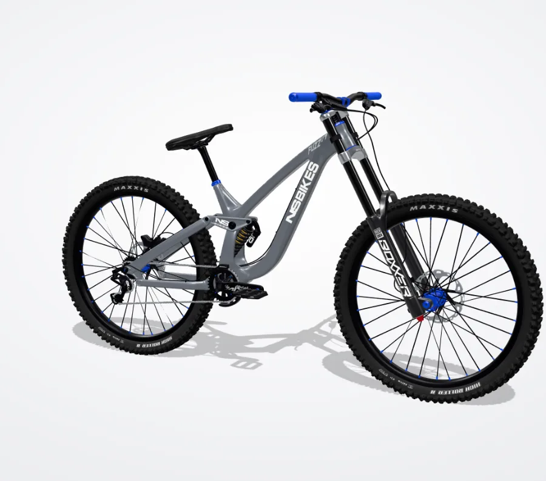
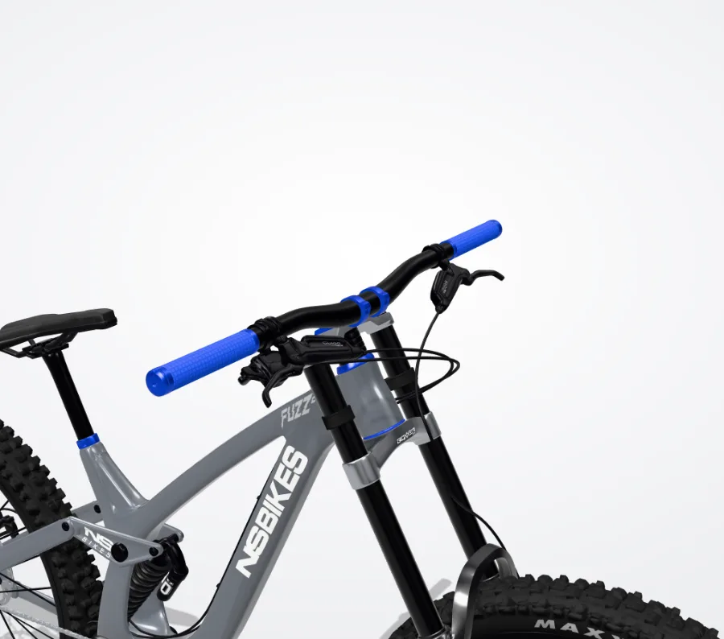
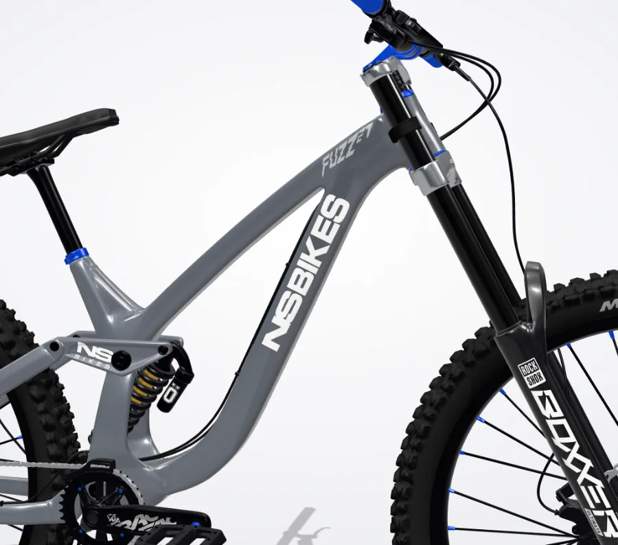

# Performance

How fast the configurator is, how it is measured, and what each optimization changed.

## Summary (before → after)

Measured on an Apple M4 (16 GB) in Chrome, 1440×900 at DPR 2 unless noted. Details per phase below.

| | Before | After |
|---|---|---|
| Renders per second when idle | 60 | **0** |
| Frame cost while dragging | 9.4 ms (1.36M tris, DPR 2) | **3.1–3.2 ms** (189k tris, DPR 1) |
| Frame cost of the one at-rest frame | 9.4 ms | 7.4–10 ms (661k tris, DPR 2: fill-bound) |
| Triangles at rest / while dragging | 1.36M / 1.36M | **661k / 190k** |
| Draw calls | 80 | 68 |
| Shader programs | 17 | **13** (11 in Fast) |
| Textures | 56 | **32** |
| JS heap | 59 MB | 39 MB (18–31 MB in Fast) |
| Fast 4G: first visual | 8.9 s | **0.90–0.97 s** (poster) |
| Fast 4G: configurable | 8.9 s | **2.73–2.78 s** (light model) |
| Fast 4G: downloaded before configurable | 7.4 MB | **2.1 MB** (detailed model follows in the background; 5.6 MB in all, 2.3 MB in Fast) |
| Long tasks after the page is configurable | | **0** |
| At rest, pixels that differ from before | | 0.43–0.95% by more than 8/255, mean ≤ 0.41/255: faint shading on glossy parts, invisible side by side |

**Against the "done when" targets:** idle renders 0 ✓ · first visual under 1 s ✓ · configurable under 3 s ✓ ·
interaction at 1440×900 DPR 2: frames cost 3.1 ms on this M4, about a fifth of a 60 fps budget; an M1's GPU is roughly 1.5–2×
slower, which still leaves a wide margin for 55+ fps, but it was not measured on an M1 ·
375 px with 4× CPU throttle: 60 fps in emulation, **with a caveat**: Chrome throttles the CPU only, the GPU is still the M4's.
The phone path is mostly GPU-bound, so this needs a check on a real mid-range phone (Auto picks Fast on weak ones).

## How to measure

- **Overlay:** open the page with `?perf`. It shows renders per second, frame time (average and worst over the last 2 s),
  the CPU time of `renderer.render()`, draw calls, triangles, shader programs, geometries, textures, pixel ratio and JS heap.
  The overlay updates on a timer, so it never causes a render itself.
- **Scenarios:** `tools/perf/bench.mjs` runs the same scenarios every time in headless Chrome:
  ```bash
  npm start                                  # in the repo root
  cd tools/perf && npm install
  node bench.mjs <label>                     # idle, drag, mobile, load, shots
  node diff.mjs baseline <label>             # pixel diff of the at-rest screenshots
  node docshots.mjs <label>                  # small WebP copies for this page
  ```
- **Regression check:** `node check.mjs` applies 25 options at 1440 and 375 px and fails if any of them doesn't render, doesn't
  stop rendering afterwards, misses a shadow update, or compiles a new shader; it also checks look undo and share links.
- **Machine:** Apple M4, 16 GB, Chrome (ANGLE Metal). This is faster than the M1-class target, so frame *time* is the number to
  compare, not fps: headless Chrome caps rAF at 60 fps, which hides how much work a frame really takes.
  `bench ms/frame` renders 30 frames at the current size and waits for the GPU after each one, so it is the true cost of a frame.

| # | Scenario | Setup |
|---|---|---|
| 1 | Idle | 1440×900 at DPR 2, overview camera, nothing moving, after all look thumbnails are done |
| 2 | Dragging | same page, mouse orbit for 2 s |
| 3 | Phone | 375×812 at DPR 3, mobile emulation, 4× CPU throttle, idle then a 2 s drag |
| 4 | First load | Chrome's "Fast 4G" (9 Mbps down, 1.5 Mbps up, 165 ms latency), cache disabled |

## Baseline (before any optimization, commit `289002c`)

| Metric | Value |
|---|---|
| Idle renders per second | **60** (the loop renders every frame, even when nothing moves) |
| Frame cost at DPR 2 (bench) | **9.4 ms** |
| Triangles per frame | 1,364,279 |
| Draw calls (main pass) | 80 |
| Shader programs | 17 |
| Geometries / textures | 99 / 56 |
| JS heap | 59 MB |
| Dragging, desktop | 60 fps, worst frame 18.7 ms |
| Phone, 4× throttle | 60 fps, worst frame 18.3 ms (canvas capped at DPR 2) |
| Fast 4G: first contentful paint | 0.7 s (page shell) |
| Fast 4G: first visual of the bike | **8.9 s** |
| Fast 4G: configurable | **8.9 s** |
| Fast 4G: transferred | **7.4 MB** (7.2 MB of it is `bike.glb`) |

At-rest screenshots hide the overlays that change between runs (perf HUD, hint, pulsing dot). With the seeded noise maps,
two loads of the same build differ in **0 pixels**, so any difference below comes from the change being measured.

| Overview | Cockpit |
|---|---|
|  |  |
| **Tire** | **Down tube** |
|  |  |

## Phase 1: stop wasting frames

- **Render on demand.** `requestRender()` schedules one frame; a frame asks for the next only while something moves: the camera
  (controls, damping, tweens, auto-rotate), a material or uniform animation, a deformation, or a pending look thumbnail.
  Resizes render synchronously, so the canvas never flashes. Rendering pauses while the tab is hidden or the stage is off screen.
- **Adaptive resolution** (`src/quality.js`). At rest the canvas keeps the pixel ratio it always had (`min(devicePixelRatio, 2)`),
  so the still image is unchanged. While the camera moves it drops to 1.5 (1.25 on touch devices), and while the user drags or
  zooms to 1.0. About 200 ms after the camera stops, one full-quality frame is rendered. A governor scales the moving resolution
  down when a frame costs more than 20 ms and back up under 10 ms, using GPU timer queries where available.
  Color fades and shape changes with a still camera keep full resolution, so clicking an option never flickers.
- **Static shadows.** `shadowMap.autoUpdate = false`; one shadow pass runs only when the silhouette changes (tread, pedals,
  guide, collars, saddle height, deformations while they animate). The map is 1024² instead of 2048², and the shadow camera is
  fitted to the bike (±0.95 m instead of ±1.5 m; the widest build, an 800 mm high-rise bar, reaches ±0.84 m), so shadow texels
  are about the same size as before.
- `preserveDrawingBuffer` is off. The image button and look thumbnails read the canvas in the same task they render it.

| Metric | Baseline | Phase 1 |
|---|---|---|
| Idle renders per second | 60 | **0** |
| Frame cost at rest, DPR 2 | 9.4 ms | 10.4 ms (one frame, then nothing) |
| Frame cost while dragging | 9.4 ms (DPR 2) | **6.5 ms** (DPR 1) |
| Shadow passes | every frame | only when the silhouette changes |
| Shader programs | 17 | 17 |
| At-rest pixels changed vs baseline | | ≤ 0.06% (soft shadow edges only) |

While dragging the frame is now triangle-bound (1.36M triangles), which is what Phase 2 addresses.

## Phase 2: lighter geometry and draw calls

- **Two LODs** (`tools/model-pipeline/lods.mjs`), built from the full web model `bike.glb` (Blender is not needed).
  Every part is simplified within a world-space error budget, with normals counted in the error so glossy highlights stay put.
  Small reflective parts whose outlines show at rest (rims, hubs, rotors, fork, saddle, levers) are kept as they are in lod0.
  The spoke nipples (143k triangles of 2 mm cylinders) go to 8.9k. Decals are never simplified.
  `check-lods.mjs` fails if the two files differ in any node, mesh, material, decal texture or attribute set.

  | File | Triangles | Size | Used for |
  |---|---|---|---|
  | `bike.glb` | 1,364,215 | 7.2 MB | pipeline source only |
  | `bike-lod0.glb` | 660,783 | 3.5 MB | desktop at rest |
  | `bike-lod1.glb` | 189,487 | 1.5 MB | first load, dragging, touch-device camera motion, look thumbnails, picking |
- **Progressive load.** A pre-rendered poster (`assets/poster/*.webp`, made by `tools/perf/poster.mjs` from the real app,
  transparent background) shows first. lod1 loads next and the page is configurable; the camera starts exactly where the
  poster was rendered, and the poster cross-fades out. lod0 then downloads in the background, is decoded in workers
  (`MeshoptDecoder.useWorkers`), built in idle callbacks, uploaded to the GPU in a hidden 1×1 render, and drawn from the next
  rest frame. No long task after the page is interactive.
- **Both LODs stay in the scene** with the same materials, decal materials and text canvases, so they are always the same
  bike. Geometry state (deformations, collars, toggles, saddle height) is applied to each model. lod0 draws at rest; lod1
  draws while the user drags (and during any camera motion on touch devices).
- **Static meshes merged:** non-configurable parts that share a material become one mesh per material at load
  (deformed, toggled, moved and decal meshes stay separate). Draw calls 80 → 68.
- **Picking** raycasts the light model only.

| Metric | Baseline | Phase 2 |
|---|---|---|
| Triangles at rest | 1,364,279 | **660,847** |
| Triangles while dragging | 1,364,279 | **189,551** |
| Draw calls | 80 | 68 |
| Frame cost at rest, DPR 2 | 9.4 ms | 8.1–9.3 ms (fill-bound now; varies run to run) |
| Frame cost while dragging | 9.4 ms | **3.0–3.6 ms** (lod1 at DPR 1) |
| Fast 4G: first visual | 8.9 s | **1.1 s** (poster) |
| Fast 4G: configurable | 8.9 s | **3.6 s** (lod1, 2.3 MB) |
| Fast 4G: at-rest model in | 8.9 s | 7.5 s (5.8 MB total, in the background) |
| At-rest pixels changed vs baseline | | 0.4–0.9% of pixels, mean 0.2–0.4 / 255 |

The at-rest differences are faint shading changes on glossy surfaces from the simplification; side by side the images
are identical (below). The poster and the loaded 3D view line up at any stage size; the poster is a fixed-size image, so
it is slightly softer until the cross-fade.

See the before/after screenshots at the end of this page.

## Phase 3: cheaper materials and textures

- **Materials.** `MeshPhysicalMaterial` stays only where a physical feature shows: frame and rear paint (clearcoat, paint
  styles), anodized parts, nipples and chain (iridescence), saddle (sheen), and the fork lowers, fork uppers and shock
  spring (clearcoat; turning it off changed 1–4% of pixels, the fork visibly lost its gloss). The other 16 materials and the
  decals are `MeshStandardMaterial` (0 pixels changed for the 16, ≤ 0.02% for the decals).
- **Programs:** the environment map's generator and room scene are disposed after use, which frees their programs.
  Shader programs 17 → **13**; no option compiles a new one (`check.mjs`).
- **Generated textures:** text canvases are 512 px on the long side (were 1024), anisotropy 4 (was 8) everywhere.
  Decals of the same spot that would draw an identical canvas share it, and decals that use the same logo image share one
  white-logo texture; the glTF's own decal bitmaps are closed once copied. Uploaded textures 56 → **32**.
  With custom text on six spots, the 512 px text differs from 1024 px in 0.1–0.3% of pixels (edge softness at the
  closest camera views, not visible side by side).
- **Look-card thumbnails** render only while the look row is on screen, one per idle callback (each costs a single frame
  instead of keeping the loop running), from the light model, as WebP, and are cached in `sessionStorage` for the session.

| Metric | Baseline | Phase 2 | Phase 3 |
|---|---|---|---|
| Shader programs | 17 | 17 | **13** |
| Textures | 56 | 56 | **32** |
| Geometries | 99 | 154 (two LODs) | 142 |
| JS heap | 59 MB | 42 MB | 39 MB |
| Frame cost at rest, DPR 2 | 9.4 ms | 8.1–9.3 ms | 7.4–7.9 ms |
| Frame cost while dragging | 9.4 ms | 3.0–3.6 ms | 3.1 ms |
| At-rest pixels changed vs baseline | | 0.4–0.9% | 0.4–0.9% (unchanged by this phase) |

## Phase 4: low-end quality mode

- **Quality: Auto / High / Fast** in the toolbar (gauge icon), saved in `localStorage` (`dh-quality`).
- **Auto** scores the device (`lowEndScore()` in `src/quality.js`): `navigator.deviceMemory` (≤ 2 GB: 2 points, ≤ 4 GB: 1),
  `hardwareConcurrency` (≤ 2 cores: 2, ≤ 4: 1), `prefers-reduced-motion` (1) and a probe of five synced frames of the light
  model at DPR 1 (> 14 ms: 2, > 9 ms: 1). Fast needs 3 points, so no single signal decides it (reduced motion alone is an
  accessibility choice, not a slow device). Devices that already score 3 before anything renders start in Fast and compile
  only the Fast shaders; the probe runs once the light model is ready.
- **Fast** = the light model only (lod0 is never downloaded), DPR 1, `MeshStandardMaterial` twins of the physical materials
  (they share the paint and saddle shader uniforms and copy the animated values, so styles, colors and hover glow still
  work), no shadow map (a soft contact shadow baked from the real one by `tools/perf/poster.mjs` instead), no auto-rotate.
- Switching modes compiles the other shader set with `compileAsync` while the last frame stays on screen: no long task
  on any switch (measured High → Fast → High → Fast → Auto). Both shader sets stay cached afterwards.

| Metric | High (Auto on this machine) | Fast |
|---|---|---|
| Triangles | 660,847 at rest, 189,551 dragging | 189,489 |
| Pixel ratio | 2 at rest, 1 dragging | 1 |
| Shader programs | 13 | 11 |
| JS heap | 39 MB | 18–31 MB |
| Frame cost | 7.4–7.9 ms at rest, 3.1 ms dragging | 1.7–3.9 ms |
| Fast 4G transferred | 5.8 MB (2.3 MB before configurable) | **2.3 MB** total |

## Phase 5: loading polish

- `<head>` starts the right poster first (picked from the window size and theme before any stylesheet), preconnects to
  jsDelivr and the font hosts, and preloads `bike-lod1.glb` (`fetchpriority="low"`, so the poster and scripts go first).
- The import map moved into `<head>` with `modulepreload` for the whole module graph (three, the five addons, the local
  modules), so it downloads in parallel instead of import by import.
- `three.module.min.js` instead of `three.module.js`: 171 KB instead of 265 KB over the wire.
- Google Fonts no longer block first paint (`media="print"` until loaded, `display=swap`); text spots wait for the sheet
  before drawing, so custom text never sticks in a fallback font.
- Desktop posters are encoded at 1.5× (106–114 KB) instead of 2× (176–182 KB); they show for a second at most.

| Fast 4G, 3 runs | After Phase 4 | After Phase 5 |
|---|---|---|
| First visual (poster) | 1.10–1.27 s | **0.94–0.97 s** |
| Configurable (light model) | 3.4–3.6 s | **2.73–2.75 s** |
| Detailed model in | 7.1–7.5 s | 6.6–6.7 s |

## Before and after, at rest

Same camera, same build (the default), UI chrome hidden. Left: before any of this work; right: now.

| Before | After |
|---|---|
|  |  |
|  |  |
|  |  |
|  |  |
