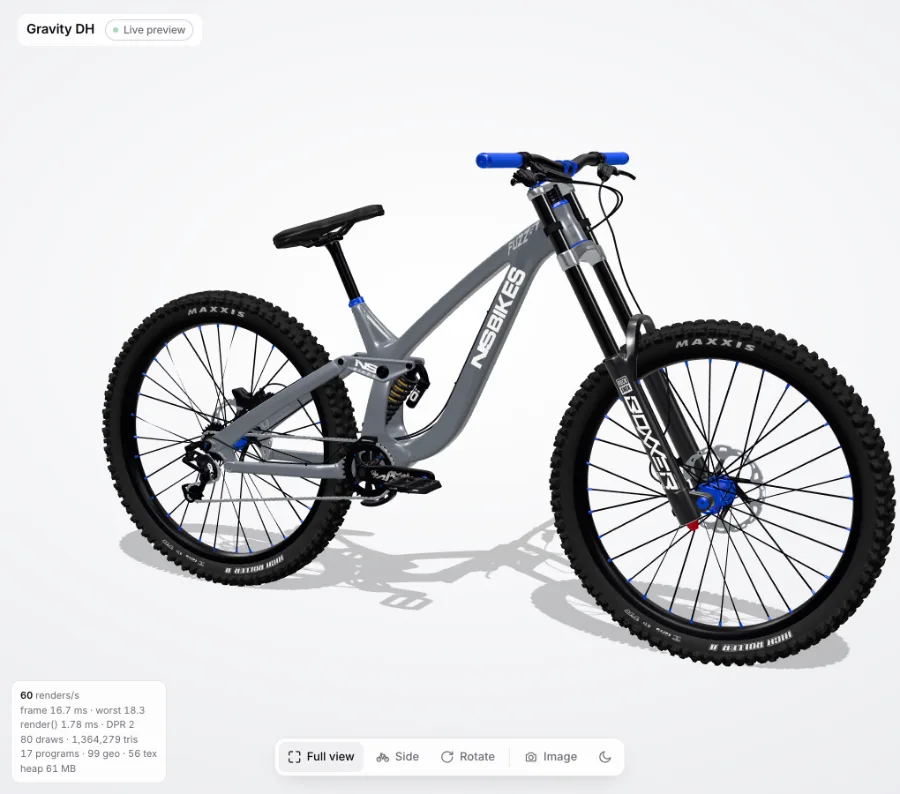
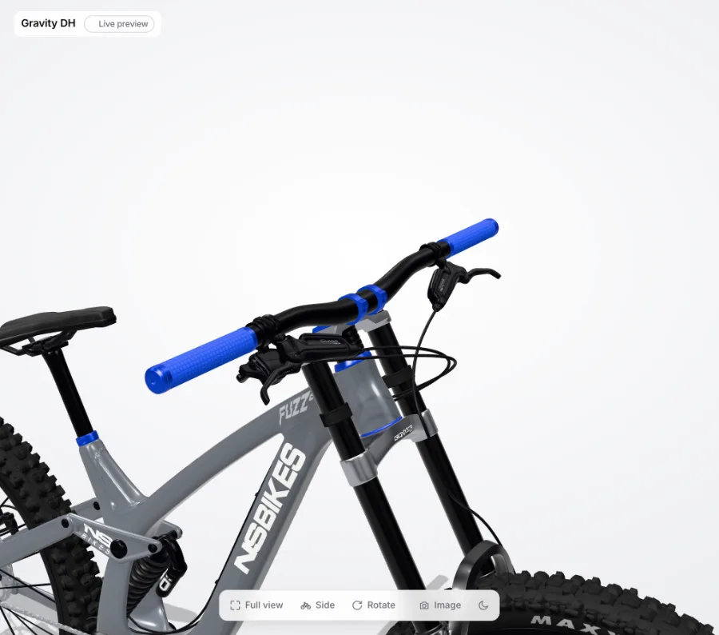
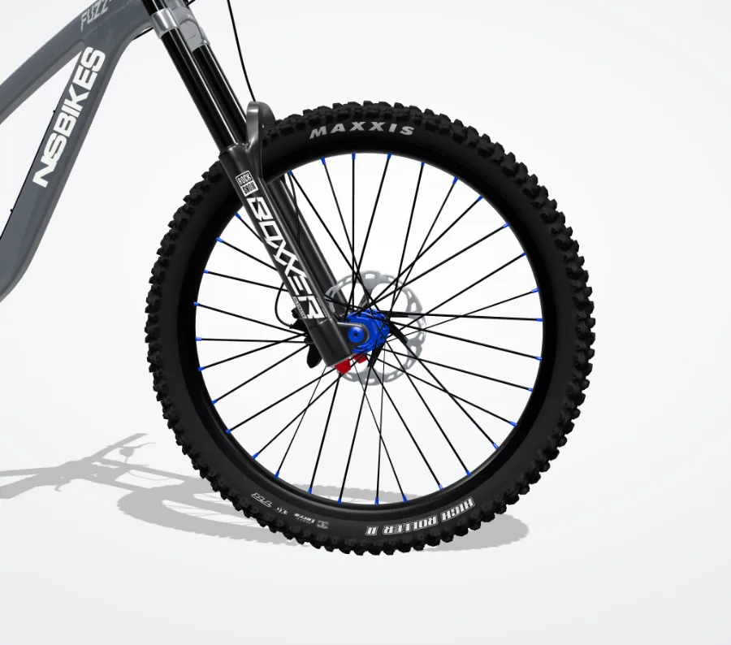
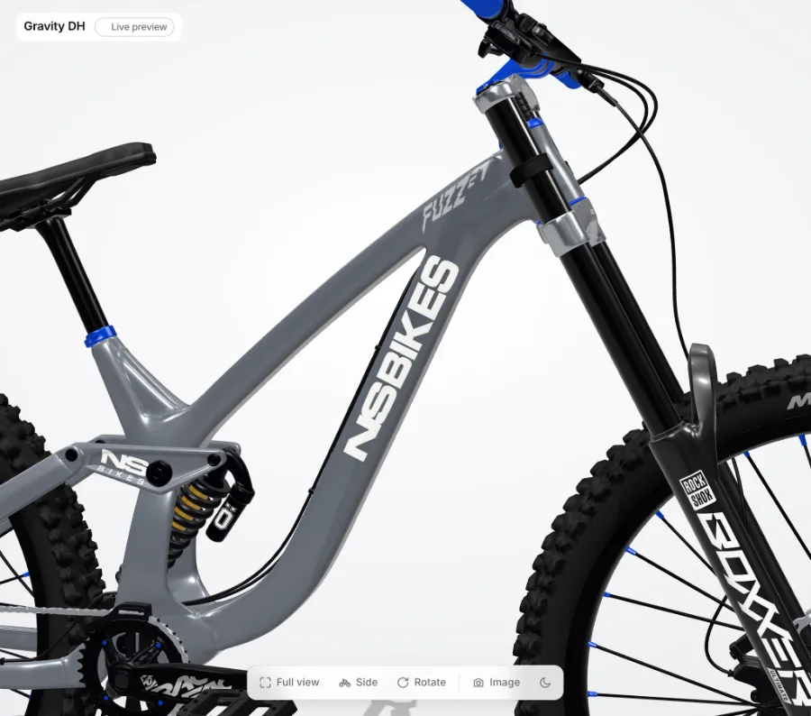

# Performance

How fast the configurator is, how it is measured, and what each optimization changed.

## How to measure

- **Overlay:** open the page with `?perf`. It shows renders per second, frame time (average and worst over the last 2 s),
  the CPU time of `renderer.render()`, draw calls, triangles, shader programs, geometries, textures, pixel ratio and JS heap.
  The overlay updates on a timer, so it never causes a render itself.
- **Scenarios:** `tools/perf/bench.mjs` runs the same scenarios every time in headless Chrome:
  ```bash
  npm start                                  # in the repo root
  cd tools/perf && npm install
  node bench.mjs <label>                     # idle, drag, mobile, load, shots
  node diff.mjs baseline <label>             # pixel diff of the at-rest screenshots
  node docshots.mjs <label>                  # small WebP copies for this page
  ```
- **Machine:** Apple M4, 16 GB, Chrome (ANGLE Metal). This is faster than the M1-class target, so frame *time* is the number to
  compare, not fps: headless Chrome caps rAF at 60 fps, which hides how much work a frame really takes.
  `bench ms/frame` renders 30 frames at the current size and waits for the GPU after each one, so it is the true cost of a frame.

| # | Scenario | Setup |
|---|---|---|
| 1 | Idle | 1440×900 at DPR 2, overview camera, nothing moving, after all look thumbnails are done |
| 2 | Dragging | same page, mouse orbit for 2 s |
| 3 | Phone | 375×812 at DPR 3, mobile emulation, 4× CPU throttle, idle then a 2 s drag |
| 4 | First load | Chrome's "Fast 4G" (9 Mbps down, 1.5 Mbps up, 165 ms latency), cache disabled |

## Baseline (before any optimization, commit `289002c`)

| Metric | Value |
|---|---|
| Idle renders per second | **60** (the loop renders every frame, even when nothing moves) |
| Frame cost at DPR 2 (bench) | **9.4 ms** |
| Triangles per frame | 1,364,279 |
| Draw calls (main pass) | 80 |
| Shader programs | 17 |
| Geometries / textures | 99 / 56 |
| JS heap | 59 MB |
| Dragging, desktop | 60 fps, worst frame 18.7 ms |
| Phone, 4× throttle | 60 fps, worst frame 18.3 ms (canvas capped at DPR 2) |
| Fast 4G: first contentful paint | 0.7 s (page shell) |
| Fast 4G: first visual of the bike | **8.9 s** |
| Fast 4G: configurable | **8.9 s** |
| Fast 4G: transferred | **7.4 MB** (7.2 MB of it is `bike.glb`) |

Two loads of the same build differ in about 0.13% of pixels (the pulsing "Live preview" dot), so that is the noise floor for
the at-rest comparisons below.

| Overview | Cockpit |
|---|---|
|  |  |
| **Tire** | **Down tube** |
|  |  |
